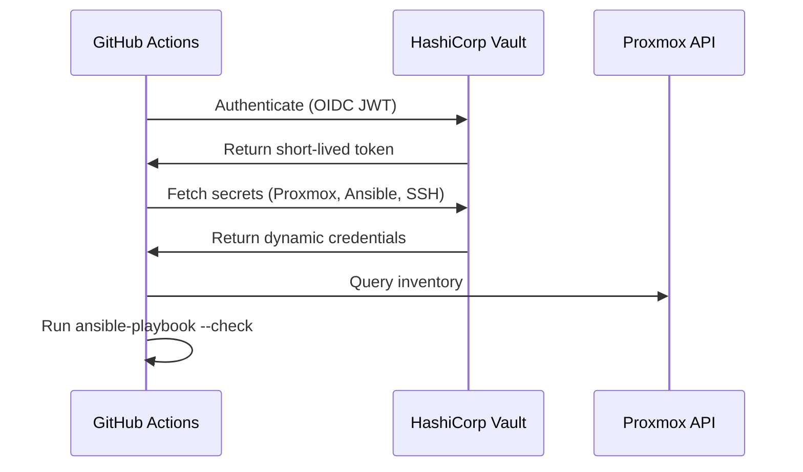

[](https://docs.ansible.com)
[](https://proxmox.com)
[](https://vaultproject.io)
[](https://docker.com)


# ApexVirtual Configuration Management

Production-grade configuration management for the ApexVirtual Platform - demonstrating automated infrastructure configuration and security baseline enforcement across hybrid cloud environments.

## 🏆 Key Results & Impact
This configuration management codebase demonstrates measurable automation capabilities:

- 🔄 **Zero Manual Configuration:** All 34 hosts (29 VMs + 5 Raspberry Pis) configured automatically via tag-based targeting from Terraform-provisioned infrastructure.
- 🛡️ **100% Secretless Operations:** All credentials retrieved dynamically from HashiCorp Vault at runtime - zero secrets stored in repository or CI/CD configuration.
- 🎯 **Tag-Driven Automation:** Terraform-applied tags automatically drive Ansible group membership, eliminating manual inventory maintenance across environment changes.
- ⚙️ **Automated Security Baseline:** Consistent firewall rules, intrusion prevention, and SSH hardening deployed across all infrastructure via idempotent role-based configuration.

## 🏗️ Repository Structure
A professional role-based layout separating inventory data from reusable configuration logic.
```
apexvirtual-ansible/
├── .github/workflows/
│   └── ansible-apexvirtual-ci.yaml     # Secretless CI with Vault OIDC
├── inventory/
│   ├── av-onprem/                      # Production on-premise environment
│   │   ├── group_vars/                 # Environment configuration data
│   │   ├── inventory.proxmox.yml       # Dynamic VM discovery via API
│   │   └── inventory.static.yml        # Static Raspberry Pi hosts
│   └── ci/                             # Mock inventory for CI validation
├── playbooks/
│   └── site.yml                        # Main entrypoint mapping roles to hosts
└── roles/
    ├── nginx/                          # Data-driven reverse proxy configuration
    ├── certbot/                        # Automated TLS via Let's Encrypt DNS-01
    ├── prometheus/ + grafana/          # Monitoring with K8s federation
    ├── fail2ban/ + ufw_rules/          # Security hardening automation
    └── 10+ additional roles            # Docker, updates, provisioning, etc.
```

## ✨ Configuration Management Capabilities
This repository showcases enterprise-grade configuration patterns integrated with the broader ApexVirtual platform.

### Infrastructure Integration
- **Dynamic Discovery:** Proxmox API integration automatically discovers VMs provisioned by Terraform, eliminating static inventory files.  
- **Tag-Based Targeting:** Terraform-applied tags (k8s-prod, vault, reverse-proxy) automatically create Ansible groups via `keyed_groups` and Jinja2 conditionals.  
- **Pipeline Integration:** This repository sits between Terraform (infrastructure provisioning) and ArgoCD (application deployment) in the complete platform pipeline.  

**[→ View Full Architecture Diagram](images/architecture-pipeline-flow.png)** *(click to open full size)* - Shows complete Terraform → Ansible → ArgoCD integration pipeline

### Security & Secrets Management
- **Vault Integration:** All credentials retrieved via `community.hashi_vault` lookups - SSH keys, API tokens, service passwords generated dynamically per execution.  
- **OIDC Authentication:** CI/CD pipeline authenticates to Vault using GitHub OIDC (JWT), retrieving temporary credentials with 1-hour TTL.  
- **Automated Hardening:** UFW firewall rules, fail2ban intrusion prevention, and SSH configuration deployed consistently across all hosts.  
- **Secrets-as-Code:** Even firewall rules and monitoring configurations retrieved from Vault, enabling centralized security policy management.

> **Note:** Vault secret paths in this repository (`kv/data/apexvirtual/*`) demonstrate the organizational structure. In production deployments, adjust these paths to match your Vault mount points and secret hierarchy.

### CI/CD Validation
- **Pre-Merge Validation:** Every PR triggers `ansible-lint`, syntax checks, and dry-run execution (`--check` mode) against live Proxmox inventory.  
- **Self-Hosted Runners:** Pipeline executes on infrastructure with internal network access, validating against actual target hosts.  
- **Zero Static Secrets:** Complete pipeline runs without any credentials stored in GitHub - all retrieved from Vault via OIDC flow.  

<details>
  <summary>Click to view the CI/CD pipeline flow</summary>

**Pipeline Stages**  
PR Created → Lint → Syntax Check → Vault OIDC Auth → Fetch Secrets → Dry Run  

- `ansible-lint` validates best practices and style  
- `ansible-playbook --syntax-check` validates all YAML syntax  
- GitHub OIDC JWT exchanged with Vault for temporary token  
- Proxmox credentials, SSH keys, and Ansible secrets retrieved from Vault  
- `ansible-playbook --check` simulates all changes against live inventory  

All credentials expire after 1 hour. No long-lived tokens exist anywhere in the pipeline. 



**Workflow Triggers**  
- `develop` branch: Continuous validation on every push  
- Pull requests to `main`: Production gatekeeper - must pass all checks before merge  
</details>

### Role-Based Architecture
- **Data-Driven Configuration:** Nginx sites, firewall rules, and monitoring targets defined as structured data in `group_vars`, separated from implementation logic.  
- **Idempotent Operations:** All roles designed for safe repeated execution - can run `site.yml` multiple times without side effects.  
- **Reusable Components:** Generic roles parameterized via variables, enabling configuration reuse across multiple environments.  

## 🎯 Infrastructure Managed

### Network Architecture
- **VLAN 283 (192.168.30.0/24):** Production Kubernetes cluster (6 nodes), Vault HA cluster (3 nodes), infrastructure services  
- **VLAN 284 (192.168.40.0/24):** Development Kubernetes cluster (3 nodes) for testing and validation  
- **VLAN 285 (192.168.50.0/24):** DMZ with Nginx reverse proxies, TLS termination, external traffic ingress  

### Host Types
- **12 Kubernetes Nodes:** 3 clusters (production HA with 3 masters, development, infrastructure services)  
- **3 Vault Servers:** HA Vault cluster providing secrets management for entire platform  
- **2 Nginx Proxies:** Reverse proxy with automated Let's Encrypt certificates via DNS-01 challenge  
- **12 Infrastructure Services:** Elasticsearch (3 nodes), Kibana, Docker registry, NFS storage, Azure DevOps build agent  
- **5 Raspberry Pis:** Resilient DNS (Pi-hole with keepalived failover), centralized Grafana/Prometheus, backup NAS  

## 💡 Technical Highlights

### Tag-Based Dynamic Inventory
Terraform provisions VMs with tags → Ansible Proxmox plugin discovers them → Jinja2 creates logical groups:  

```yaml
# In Terraform: tags = ["k8s-prod", "master", "ha"]
# In inventory.proxmox.yml:
groups:
  kubernetes: "'k8s-prod' in proxmox_tags_parsed or 'k8s-dev' in proxmox_tags_parsed"
  vault_cluster: "'vault' in proxmox_tags_parsed"
```
**Result:** `ansible-playbook site.yml --limit kubernetes` automatically targets correct hosts. Infrastructure changes in Terraform flow to Ansible without inventory updates.

### Data-Driven Nginx Configuration
Single variable defines all reverse proxy sites, role generates configs and manages service:  

```yaml
nginx_sites:
  - name: vaultwarden
    server_name: "vault.lab.apexvirtual.internal"
    template: "vaultwarden.conf.j2"
    backend_servers: ["192.168.30.103:30080", "192.168.30.102:30080", "192.168.30.105:30080"]
```
- Multiple Jinja2 templates handle service-specific requirements (websockets, upstream load balancing, rate limiting).  
- Adding new service requires only variable change.  

### Monitoring with Prometheus Federation
- Central Prometheus federates metrics from 3 Kubernetes cluster Prometheus instances  
- Node exporters deployed to all 34 hosts via Docker containers  
- Grafana datasources auto-configured with Vault-retrieved credentials  
- Scrape targets dynamically generated from Ansible inventory (excludes Kubernetes hosts, includes all VMs and Raspberry Pis)  

## 🛠️ Technology Stack
- **Configuration Management:** Ansible Core 2.19  
- **Dynamic Inventory:** community.proxmox plugin  
- **Secrets Management:** HashiCorp Vault with `community.hashi_vault` collection  
- **CI/CD:** GitHub Actions with self-hosted runners  
- **Container Runtime:** Docker for service deployment (Prometheus, Grafana, node-exporter)  

## Professional Context
This platform demonstrates key configuration management competencies:  

- **Infrastructure Automation:** Dynamic inventory patterns, tag-based targeting, conditional group creation, mixed static/dynamic host sources  
- **Security Engineering:** Vault integration, OIDC authentication, zero static secrets, automated security baseline enforcement  
- **Configuration as Code:** Role-based architecture, data-driven configuration, idempotent operations, template-based service deployment  
- **CI/CD Practices:** Automated validation, secretless pipelines, check-mode verification against live systems, self-hosted runner deployment  

## Portfolio Links
- **Infrastructure Provisioning:** [apexvirtual-terraform](https://github.com/fashomelab/apexvirtual-terraform)
- **Main Platform Overview:** [ApexVirtual Platform](https://github.com/fashomelab/corneb)  

---
Available for Platform Engineering roles - Remote/Hybrid (Portsmouth UK area)  

Configuration management powering the ApexVirtual platform - designed to showcase production-ready automation patterns through practical implementation of enterprise configuration management practices.
